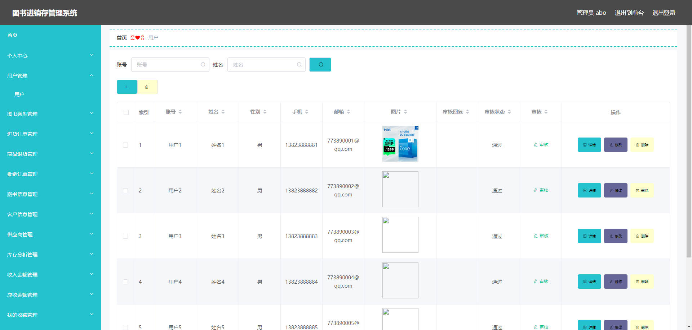

# 基于Springboot的图书进销存管理系统

## Springboot-0071


## 技术栈

Springboot mybatisplus vue mysql maven


## 数据库表(16张)


## 功能介绍

```properties
本图书进销存管理系统管理员功能有个人中心，用户管理，图书类型管理，进货订单管理，商品退货管理，批销订单管理，图书信息管理，客户信息管理，供应商管理，库存分析管理，收入金额管理，应收金额管理，我的收藏管理。

用户功能有个人中心，图书类型管理，进货订单管理，商品退货管理，批销订单管理，图书信息管理，客户信息管理，供应商管理，库存分析管理，收入金额管理，应收金额管理。
```


## 图片

### 前台


### 后台




## 访问路径

### 前台

```properties
http://localhost:8080/springbootk6oce/front/pages/login/login.html

账号 用户6
密码 123456
```

### 后台

```properties
http://localhost:8080/springbootk6oce/admin/dist/index.html#/login

账号 abo
密码 abo
```


## 功能图


## 文档目录


## 打赏或交流


